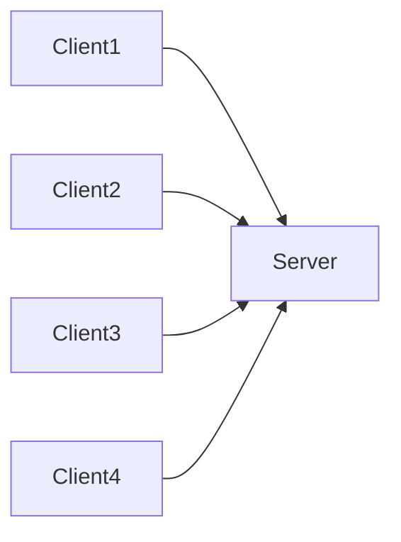
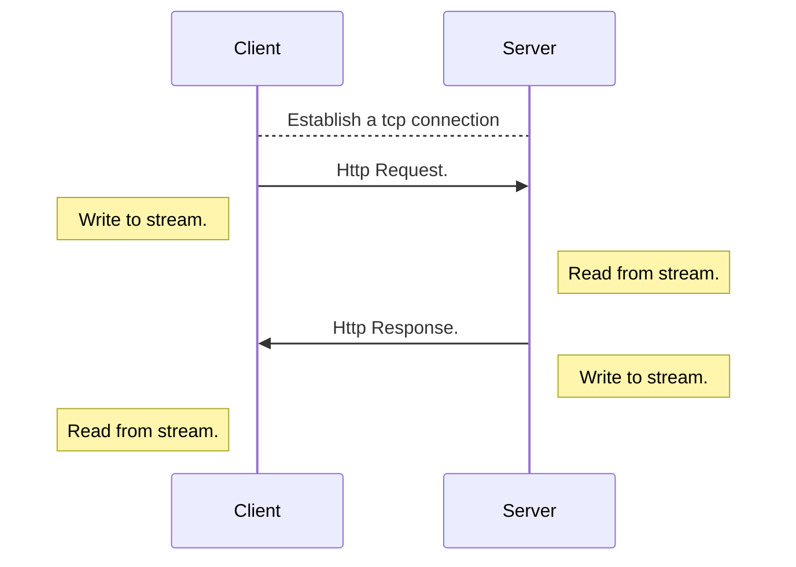

# Asynchronous I/O

A deep dive into asynchronous IO with rust and MIO. 

<!--
The last comment block of each slide will be treated as slide notes. It will be visible and editable in Presenter Mode along with the slide. [Read more in the docs](https://sli.dev/guide/syntax.html#notes)
-->

---

## What to expect

<hr>

<v-clicks>

- The evolution of web server architectures.
- Gain deeper understanding of the rust async ecosystem.
- Have fun.

</v-clicks>

---

# Table of contents

<Toc maxDepth="1"></Toc>

---

# Web server architectures

- Built on top of TCP (also UDP).
- Communication through network sockets ( IP + PORT).
- Server listens on a socket. ( exposes a port on an IP address ).
- Client connects to a socket. ( connects to a port on an IP address ).
- A stream is a duplex communication channel established between a client and server.

---

## A simple architecture



<hr>

---



---

# The evolution

The current state of web is a result of decades of learnings.

<v-clicks>

- Single threaded.
- Multi threaded.
- Asynchronous. 

</v-clicks>

Let's look at each of them. 

The web server should be capable of sleeping ( to simulate IO ).
The sleep time will be specified in the request.

```txt
GET /1000
```

Sleep for `1000` ms

---

# Single Thread

```rust {1|5-6|8|9-10} {maxHeight:'200px'}
use std::net::TcpListener;

/// This server is run on a single thread, does blocking IO
fn main() {
    let address = "127.0.0.1:6969";
    let listener = TcpListener::bind(address).unwrap();

    for stream in listener.incoming() {
        let stream = stream.unwrap();
        server::handle_connection(stream);
    }
}
```
<v-click>

```rust {1|2|4|6-9|11} {maxHeight:'230px'}
pub fn handle_connection(mut stream: net::TcpStream) {
  let sleep_time = parse_request(stream);

  std::thread::sleep(Duration::from_millis(sleep_time.into()));

  let status_line = "HTTP/1.1 200 OK";
  let contents = fs::read_to_string("static/index.html").unwrap();
  let length = contents.len();
  let response = format!("{status_line}\r\nContent-Length: {length}\r\n\r\n{contents}");

  stream.write_all(response.as_bytes()).unwrap();
}
```

</v-click>

---

# Benchmark

Drill is a HTTP load testing application written in Rust. https://github.com/fcsonline/drill.

The configuration file.
```yaml {2|3|1|5-8}
concurrency: 150
base: "http://localhost:6969"
iterations: 150

plan:
  - name: Fetch base
    request:
      url: /1000
```

<hr>

<v-click>

Run the benchmark

```bash
drill --benchmark drill.yaml --stats
```

</v-click>

---

## Single thread - performance

Well! It is pretty bad. What are the findings.

- A single thread is blocked on IO.
- When a thread is blocked on IO, it cannot handle another request.

<br>

### A single threaded server cannot handle multiple requests at once

How do we solve this? What would a *good project manager* do? A quick an easy way to make our application handle parallel requests.

<v-click>

_Throw money at the problem and spin off more threads_

</v-click>

<v-click>

We can spawn off a thread for handling each request.

</v-click>

---

## Multiple thread

```rust {11}
use std::net::TcpListener;

/// This server is run each request on its own thread, does blocking IO.
fn main() {
    let address = "127.0.0.1:6969";
    let listener = TcpListener::bind(address).unwrap();

    for stream in listener.incoming() {
        let new_stream = stream.unwrap();

        std::thread::spawn(|| server::handle_connection(new_stream));
    }
}
```
<v-click>

In case of rust, `std::thread` always creates an OS thread. Managed by the Operating system.

</v-click>

---

## Multi thread - performance

```txt
Time taken for tests      1.0 seconds
Total requests            150
Successful requests       150
Failed requests           0
Requests per second       145.23 [#/sec]
Median time per request   1020ms
Average time per request  1018ms
Sample standard deviation 3ms
99.0'th percentile        1028ms
99.5'th percentile        1028ms
99.9'th percentile        1028ms
```

<v-click>

Congratulations, our application is performant! It's time to make it efficient.

</v-click>

<v-click>

Think like a software emgineer.

</v-click>

---

## Types of processes

| CPU bound                                                                               | IO bound                                                                                            |
| --------------------------------------------------------------------------------------- | --------------------------------------------------------------------------------------------------- |
| Program spends most of its time doing CPU operations                                    | Program spends most of its time talking to a slow device, like a network connection or a hard drive |
| CPU is busy all the times                                                               | CPU is idle most of the times                                                                       |
| Speeding it up involves finding ways to do more computations in the same amount of time | Speeding it up involves overlapping the times spent waiting for these devices.                      |

<br>
<br>

<v-click>

So where does our program or in case most of the web servers stand?

</v-click>

<v-click>

IO Bound

</v-click>

---

# Concurrency

A deeper understanding.

---

## Green threads

- In computer programming, a green thread (virtual thread) is a thread that is scheduled by a runtime library or virtual machine (VM) instead of natively by the underlying operating system (OS).
- Green threads emulate multithreaded environments without relying on any native OS abilities

The basic concept is, in IO bound processes since there is no much computation that is required, We need not create OS threads all the time.

A language runtime can be considered as a supervisor for handling concurrency.

---

## Revisiting threads

| OS threads                 | User threads / Green threads            |
| -------------------------- | --------------------------------------- |
| Created at the OS level    | Create at user / languate runtime level |
| Requires a system call     | Does not require a system call          |
| Is run on a dedicated core | Are run on the same thread              |
| Comparatively heavier      | Lighther to create and context switch   |
| Parallel execution         | Concurrent Execution                    |
| **Preemptive scheduling**  | **Cooperative scheduling**              |

---

## Coroutines - Cooperative

Coroutines are computer program components that allow execution to be suspended and resumed.
These are special functions that can remember the state in between function calls.

Functionality provided by the programming language.

<v-clicks>

- This is exactly what we need. 
- But rust does not allow creation of coroutines / generators at user level.
- async functions are essentially generators, which suspend execution between `await` calls.

</v-clicks>

---
# The rust async ecosystem

`asynchronous Rust code does not run on its own, so you must choose a runtime to execute it`
- Tokio

This keeps the code executor agnostic.

<v-clicks>
- Rust provides language support to write async code.
- Tokio provides an executor to run async code.
<v-click>

---


# Connect with me

- https://www.linkedin.com/in/narayan-bhat166/
- https://github.com/Narayanbhat166
