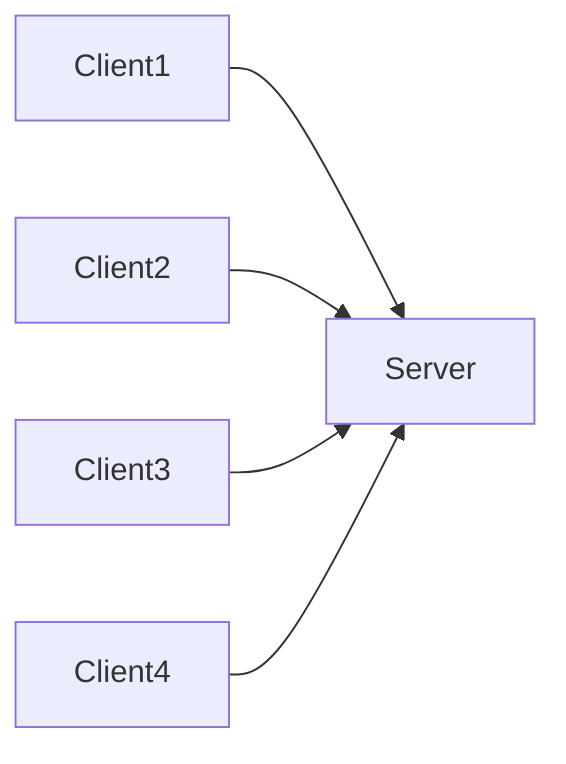
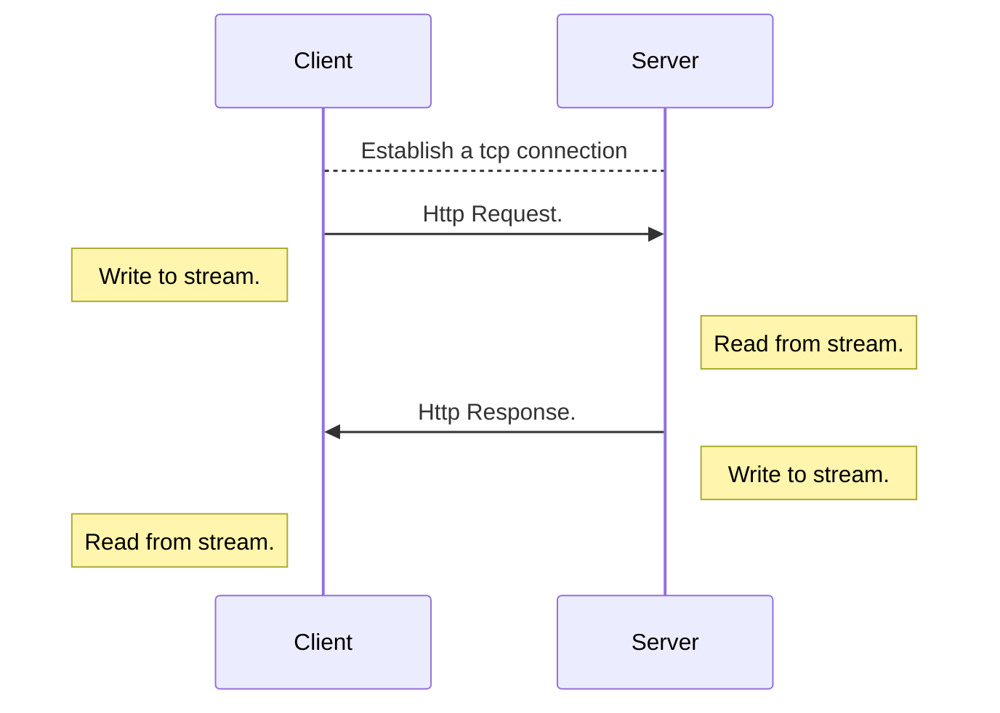
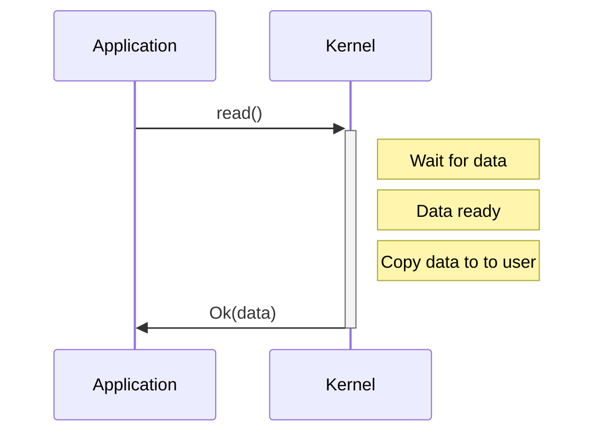
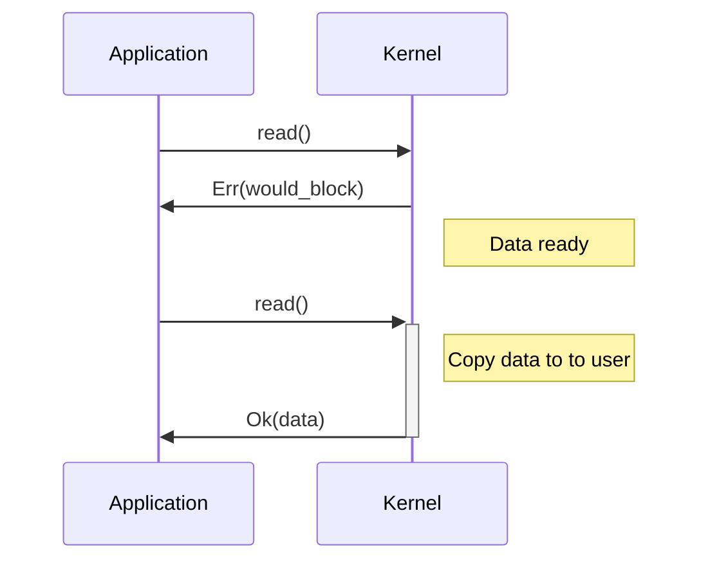
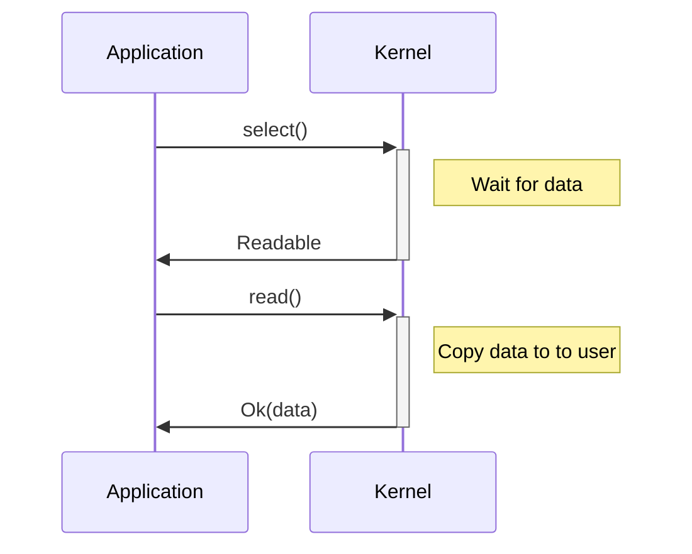

# Asynchronous I/O

A deep dive into asynchronous IO with rust and MIO.

<!--
The last comment block of each slide will be treated as slide notes. It will be visible and editable in Presenter Mode along with the slide. [Read more in the docs](https://sli.dev/guide/syntax.html#notes)
-->

---

## What to expect

<br>
<hr>
<br>

<v-clicks>

- The evolution of web server architectures.

- Gain deeper understanding of the rust async ecosystem.

- Have fun.

</v-clicks>

---

# Web server architectures

- Built on top of TCP ( also UDP ).
- Communication through network sockets ( IP + PORT).
- Server listens on a socket. ( exposes a port on an IP address ).
- Client connects to a socket. ( connects to a port on an IP address ).
- A stream is a duplex communication channel established between a client and server.

---

## A simple architecture



<hr>

---



---

# The evolution

The current state of web is a result of decades of learnings.

<v-clicks>

- Single threaded.
- Multi threaded.
- Asynchronous.

</v-clicks>

Let's look at each of them.

The web server should be capable of sleeping ( to simulate IO ).
The sleep time will be specified in the request.

```txt
GET /1000
```

Sleep for `1000` ms

---

# Single Thread

```rust {1|5-6|8|9-10} {maxHeight:'200px'}
use std::net::TcpListener;

/// This server is run on a single thread, does blocking IO
fn main() {
    let address = "127.0.0.1:6969";
    let listener = TcpListener::bind(address).unwrap();

    for stream in listener.incoming() {
        let stream = stream.unwrap();
        server::handle_connection(stream);
    }
}
```

<v-click>

```rust {1|2|4|6-9|11} {maxHeight:'230px'}
pub fn handle_connection(mut stream: net::TcpStream) {
  let sleep_time = parse_request(stream);

  std::thread::sleep(Duration::from_millis(sleep_time.into()));

  let status_line = "HTTP/1.1 200 OK";
  let contents = fs::read_to_string("static/index.html").unwrap();
  let length = contents.len();
  let response = format!("{status_line}\r\nContent-Length: {length}\r\n\r\n{contents}");

  stream.write_all(response.as_bytes()).unwrap();
}
```

</v-click>

---

## Benchmark

Drill is an HTTP load testing application written in Rust. https://github.com/fcsonline/drill.

The configuration file.

```yaml {2|3|1|5-8}
concurrency: 150
base: "http://localhost:6969"
iterations: 150

plan:
  - name: Fetch base
    request:
      url: /1000
```

<hr>

<v-click>

Run the benchmark

```bash
drill --benchmark drill.yaml --stats
```

</v-click>

---

## Single thread - performance

Well! It is pretty bad. What are the findings.

- A single thread is blocked on IO.
- When a thread is blocked on IO, it cannot handle another request.

<br>

### A single threaded server cannot handle multiple requests at once

How do we solve this? What would a _good project manager_ do? A quick an easy way to make our application handle parallel requests.

<v-click>

_Throw money at the problem and spin off more threads_

</v-click>

<v-click>

We can spawn off a thread for handling each request.

</v-click>

---

# Multi thread

```rust {11}
use std::net::TcpListener;

/// This server is run each request on its own thread, does blocking IO.
fn main() {
    let address = "127.0.0.1:6969";
    let listener = TcpListener::bind(address).unwrap();

    for stream in listener.incoming() {
        let new_stream = stream.unwrap();

        std::thread::spawn(|| server::handle_connection(new_stream));
    }
}
```

<v-click>

In case of rust, `std::thread` always creates an OS thread. Managed by the Operating system.

</v-click>

---

## Multi thread - performance

```txt
Time taken for tests      1.0 seconds
Total requests            150
Successful requests       150
Failed requests           0
Requests per second       145.23 [#/sec]
Median time per request   1020ms
Average time per request  1018ms
Sample standard deviation 3ms
99.0'th percentile        1028ms
99.5'th percentile        1028ms
99.9'th percentile        1028ms
```

<v-click>

Congratulations, our application is performant! It's time to make it efficient.

</v-click>

<v-click>

Think like a software emgineer.

</v-click>

---

## Types of processes

| CPU bound                                                                               | IO bound                                                                                            |
| --------------------------------------------------------------------------------------- | --------------------------------------------------------------------------------------------------- |
| Program spends most of its time doing CPU operations                                    | Program spends most of its time talking to a slow device, like a network connection or a hard drive |
| CPU is busy all the times                                                               | CPU is idle most of the times                                                                       |
| Speeding it up involves finding ways to do more computations in the same amount of time | Speeding it up involves overlapping the times spent waiting for these devices.                      |

<br>
<br>

<v-click>

So where does our program or in case most of the web servers stand?

</v-click>

<v-click>

IO Bound

</v-click>

---

# Concurrency

A deeper understanding.

---

## Green threads

- In computer programming, a green thread (virtual thread) is a thread that is scheduled by a runtime library or virtual machine (VM) instead of natively by the underlying operating system (OS).
- Green threads emulate multithreaded environments without relying on any native OS abilities

The basic concept is, in IO bound processes since there is no much computation that is required, We need not create OS threads all the time.

A language runtime can be considered as a supervisor for handling concurrency.

---

## Revisiting threads

| OS threads                 | User threads / Green threads            |
| -------------------------- | --------------------------------------- |
| Created at the OS level    | Create at user / languate runtime level |
| Requires a system call     | Does not require a system call          |
| Is run on a dedicated core | Are run on the same thread              |
| Comparatively heavier      | Lighther to create and context switch   |
| Parallel execution         | Concurrent Execution                    |
| **Preemptive scheduling**  | **Cooperative scheduling**              |

---

## Coroutines - Cooperative

Coroutines are computer program components that allow execution to be suspended and resumed.
These are special functions that can remember the state in between function calls.

Functionality provided by the programming language.

<v-clicks>

- This is exactly what we need.
- But rust does not allow creation of coroutines / generators at user level.
- async functions are essentially generators, which suspend execution between `await` calls.

</v-clicks>

---

# The rust async ecosystem

 > Asynchronous Rust code does not run on its own, so you must choose a runtime to execute it

This keeps the code executor agnostic.

<v-clicks>
- Rust provides language support to write async code.
- Tokio provides an executor to run async code.
</v-clicks>

---

## The language support

Futures and Tasks

- A Future in Rust represents a value that may not have been computed yet.
- Task is a future that the executor schedules for execution. These tasks are non-blocking and can yield control when not ready to proceed, allowing other tasks to run.
  ( A program and a process analogy )

---

# Futures

> In essence, a future represents a value that might not be ready yet. Usually, the future becomes complete (the value is ready) due to an event happening somewhere else

`An event happening somewhere else`. 

The future trait 

```rust
pub trait Future {
    type Output;

    fn poll(self: Pin<&mut Self>, cx: &mut Context<'_>) -> Poll<Self::Output>;
}
```

The Context object is used to wake up the future when it becomes ready to continue execution

```rust
pub enum Poll<T> {
    Ready(T),
    Pending,
}
```

---

# What to do with Futures?
`await` and `spawn`

<v-clicks>

- `await` -> runs the future as a task pinned to the current thread, blocking that thread until a result is produced and returned. ( immediately polled )
- `spawn` -> runs the future on a thread pool, which launches a future as an independent task on the pool. ( polled when scheduled )

</v-clicks>

<v-clicks>

- Once the future is scheduled to be executed, it calls the poll method to make progress on the future.
- If poll returns `Ready`, return the Result.
- If poll returns `NotReady`, 
  - Register to be notified when some event occurs
  - Return the handle to executor so that executor can run some other task on current thread.

</v-clicks>
---

# Futures as a state machine

A `Future` is almost always made up of a chain of other futures.

At any given time in the lifecycle of a future, it can be in one of the many possible states. every time the task wakes up to continue polling, it continues execution from the current state

```rust {1-5|7-12|8|2|9|2|3|10|3|4|11}
async fn get_data(db: &dyn Database) -> Result<Posts>{
  let user = db.find_user(user_id).await;
  let posts = db.find_posts(user_id).await;
  Ok(posts)
}

enum GetDataFuture {
  Start,
  FindUser(user_id),
  FindPosts(user_id),
  Done
}
```

The poll method here will attempt to make progress through the state machine by polling the underlying futures as appropriate.


---

# The runtime / executor 

- IO Event loop ( reactor ) to check for completion / readiness of IO events. Built on top of MIO.
- A task scheduler and executor.

<v-clicks>

- Executor -> Run the future and make progress.
- Reactor -> Pool for IO events and wake futures that can make progress. 

</v-clicks>

<v-click>

There are variety of Executors to choose from.

- async-std
- smol

</v-click>


Let's go over the fundamentals.

---

# IO multiplexing and Non Blocking IO

When a server is dealing with multiple IO, We want to be notified if one or more I/O conditions are read for read or write.

- Input is ready to be read.
- Descriptor is capable of taking more output.

This capability is called I/O multiplexing.

Phases of Input Operation.

- Waiting for the data to be ready. This involves waiting for data to arrive on the network. When the packet arrives, it is copied into a buffer within the kernel.
- Copying the data from the kernel to the process. This means copying the (ready) data from the kernel's buffer into our application buffer.

---

# Blocking IO

By default all sockets are blocking.



---

# Non Blocking IO

When an I/O operation that I request cannot be completed without putting the process to sleep, do not put the process to sleep, but return an error instead

- Application has to repeatedly `poll` the file descriptor to check whether the socket is readable.


---



---

# IO multiplexing

An essential observation is that it is extremely inefficient to individually poll the OS for each IO in progress. Instead, the user should poll the OS about all or many IOs in progress and find out which are ready/complete.

Use special system calls (`select` or `poll` ) to wait for any one of the file descriptors to be ready for read / write.

- Block in one of these two system calls, instead of blocking in the actual IO.
- We block in a call to select, waiting for the datagram socket to be readable.
- When select returns that the socket is readable, we then call recvfrom to copy the datagram into our application buffer.

<br>
<hr>
<br>

<v-clicks>

- We can wait for more then one file descriptor to be ready.
- Requires two system calls. `select` and `read`.

</v-clicks>

---



---
layout: two-cols
---
# Readiness
<br>

Operating System notifies the user when the resource is ready to read or write.

<br>

```c {1|2|3|4|5|6|}
// Readiness
start_some_io();
when io_is_ready {
    let mut buf = ...;
    read(&mut buf);
    // Do something with the data we read into buf.
}
```
- Simple and easy to use, No eager allocation of memory is required. Reduces memory usage.
- permits multiple IOs on the same thread to share a buffer
- Epoll and kqueue


::right::

# Completion

<br>

Operating System notifies the user when reading or writing from the IO resource is complete.

<br>

```c {1|2|3|4|5|}
// Completion
let mut buf = ...;
start_some_io(&mut buf);
when io_is_complete {
    // Do something with the data we read into buf.

}

- Requires eager allocation of buffers.
- Permits a zero-copy approach where data can be written directly to/from user memory without being copied by the OS.
- IOCP and io_uring

```
---

# Practical example
Metal IO - Mio is a fast, low-level I/O library for Rust focusing on non-blocking APIs and event notification for building high performance I/O apps with as little overhead as possible over the OS abstractions.

Tokio Reactor / Event loop is built on top of Metal IO.

---


# Connect with me

- https://www.linkedin.com/in/narayan-bhat166/
- https://github.com/Narayanbhat166
